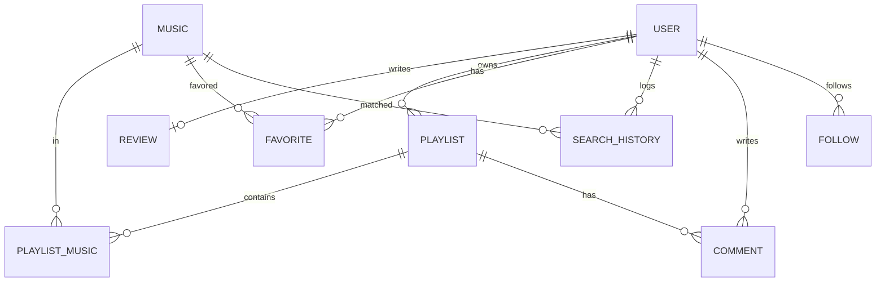

# Melolist-v3 PRD (Product Requirements Document)

> **문서 상태:** 초안 (Draft v0.1) · `prd.txt` 요청서 + 기존 Melolist-v2(Nuxt) 코드 분석 기반
> **작성 원칙:** 기존 코드를 그대로 이식하지 않고, 더 나은 구조로 **재설계**. UX·유지보수성 최우선.
> **표기:** `(신규 제안)` = 기존에 없던 추가 제안 · `(확인 필요)` = 사용자 결정 대기 항목

---

## 목차
1. [프로젝트 소개](#1-프로젝트-소개)
2. [목표](#2-목표)
3. [기술 스택](#3-기술-스택)
4. [시스템 아키텍처](#4-시스템-아키텍처)
5. [기능 명세](#5-기능-명세)
6. [화면 구성](#6-화면-구성)
7. [API 설계](#7-api-설계)
8. [Database 설계](#8-database-설계)
9. [사용자 Flow](#9-사용자-flow)
10. [UX 개선사항](#10-ux-개선사항)
11. [AI 확장 계획](#11-ai-확장-계획)
12. [개발 우선순위](#12-개발-우선순위)
13. [Milestone](#13-milestone)
14. [향후 개선사항](#14-향후-개선사항)

---

## 1. 프로젝트 소개

**Melolist**는 마이크로 녹음한 오디오(원곡 재생 또는 직접 흥얼거림)로 음악을 찾아주는 서비스다. 음원 지문(fingerprint)과 허밍(humming) 두 가지 인식 방식을 제공하며, 검색 결과에서 곡 정보와 유튜브 링크를 제공한다.

**Melolist-v3**는 기존 Melolist-v2(Vue + Nuxt + Node)를 **React + Spring Boot + Supabase** 스택으로 재플랫폼하는 프로젝트다. 단순 포팅이 아니라 다음을 목표로 한다.

- 확장 가능한 **Domain 중심 백엔드 아키텍처**
- **모바일 우선**의 현대적 UI/UX (Spotify / Apple Music 수준)
- **플레이리스트 · 즐겨찾기 · 커뮤니티 · AI 추천**으로의 기능 확장
- 프론트엔드 / 백엔드 저장소(폴더) 분리로 형상관리 용이성 확보

### 기존 v2 대비 핵심 변화
| 영역 | v2 (Nuxt) | v3 (목표) |
|---|---|---|
| 프론트 | Nuxt/Vue SSR 단일 앱 | React SPA (React Native 고려 구조) |
| 백엔드 | Nitro 서버 라우트 | Spring Boot (Domain 중심) |
| DB 접근 | Prisma + raw mysql2 **이중화** | Spring Data JPA **단일화** |
| 인증 | 손수 짠 OAuth + 평문 쿠키 | Supabase Auth + JWT |
| 기능 범위 | 음악 검색 + 서비스 리뷰 | + 플레이리스트/즐겨찾기/커뮤니티/AI |

---

## 2. 목표

### 2.1 비즈니스 목표
- 음악 인식 → **저장(플레이리스트/즐겨찾기)** → **공유(커뮤니티)** 로 이어지는 리텐션 루프 구축
- "검색 도구"에서 "**개인 음악 아카이브 + 커뮤니티**"로 서비스 포지션 확장

### 2.2 제품 목표
- 비회원도 핵심 기능(검색)은 즉시 사용, 저장/공유는 로그인 유도
- 모바일에서 한 손으로 쓰기 쉬운 인터랙션
- 향후 AI 기능(자연어 검색, 추천)을 무리 없이 얹을 수 있는 구조

### 2.3 기술 목표
- Domain 경계가 명확한 백엔드 → 기능 추가 시 영향 범위 최소화
- 타입 안정성(TypeScript + JPA Entity) 및 계약 기반 API(DTO)
- CI/CD 자동화(GitHub Actions) + 컨테이너 배포(Docker → AWS)

### 2.4 성공 지표(KPI, 확정)
- 검색 매칭률, 검색→저장 전환율, 리뷰 작성률, 재방문율(D7/D30)
- 측정 도구는 M6(하드닝)에서 확정. 초기엔 서버 이벤트 로깅으로 원천 데이터만 확보.

---

## 3. 기술 스택

### Frontend
| 구분 | 선택 | 비고 |
|---|---|---|
| Core | **React + TypeScript** | React Native 확장 고려한 컴포넌트/상태 분리 |
| Routing | React Router | |
| Server State | **TanStack Query** | 캐싱·무한스크롤·리페치 |
| Client State | **Zustand** | 플레이어/모달/세션 등 전역 UI 상태 |
| HTTP | Axios | 인터셉터로 JWT 주입·401 갱신 |
| Audio | **wavesurfer.js**(파형) + Web Audio/MediaRecorder | v2 로직 재사용 가능 |
| 스타일 | **Tailwind CSS v4** + 디자인 토큰 | 다크 기본 · 모바일 우선 |
| UI 컴포넌트 | **shadcn/ui (Radix UI)** | 접근성·조합형 프리미티브 — 직접 안 짜고 조합 |
| 모션 | **Framer Motion (`motion`)** | spring · stagger · blur · micro-interaction |
| 아이콘 / 타이포 | **Lucide** / **Inter Variable**(자체 호스팅) | |

### Backend
| 구분 | 선택 | 비고 |
|---|---|---|
| Runtime | **Java 21 (LTS)** | 장기 지원 + 가상 스레드·패턴매칭. **Spring AI(M5) 대비** 최신 LTS 기준 통일 |
| Framework | **Spring Boot 3.5** | Domain 중심 패키지 구조. LTS 계열·성숙, Spring AI 생태계 정합 |
| Security | **Spring Security** | Supabase JWT 검증(Resource Server), Role 기반 인가 |
| ORM | **Spring Data JPA / Hibernate** | 단일 데이터 접근 계층 |
| 부가 | Lombok, Bean Validation | 보일러플레이트 제거·입력 검증 |
| 외부연동 | ACRCloud(지문/허밍/메타데이터), (신규 제안) Spring AI | RestClient/WebClient |

### Data / Infra
| 구분 | 선택 | 비고 |
|---|---|---|
| DB | **Supabase PostgreSQL** | |
| Auth | **Supabase Auth** + JWT | **Google · 이메일**(확정). Naver(커스텀 OAuth)는 수요 확인 시 후속 |
| Storage | **Supabase Storage** | 커버 이미지용. **녹음 오디오 원본은 미저장**(결정) |
| 배포 | Docker · GitHub Actions · AWS(예정) | |

> **인증 아키텍처 주의:** 프론트는 Supabase JS SDK로 로그인 → JWT 발급. 백엔드(Spring Security)는 이 JWT를 **JWKS로 검증만** 한다. 최초 접근 시 `profiles` 레코드를 프로비저닝(JIT)한다. Refresh Token은 Supabase가 관리.

---

## 4. 시스템 아키텍처

### 4.1 상위 구성
```
┌────────────────────┐        ┌───────────────────────────┐
│   React SPA        │  JWT   │   Spring Boot (Domain)     │
│  (Vercel/S3+CDN)   │──────► │  auth·user·music·search    │
│  TanStack/Zustand  │  REST  │  playlist·community·reco   │
└─────────┬──────────┘        └───────┬──────────┬─────────┘
          │ Supabase JS SDK           │ JPA      │ RestClient
          ▼                           ▼          ▼
   ┌─────────────┐            ┌──────────────┐  ┌──────────────┐
   │ Supabase    │            │  Supabase    │  │  ACRCloud    │
   │ Auth (JWT)  │            │  PostgreSQL  │  │  (+ 향후 AI) │
   └─────────────┘            │  + Storage   │  └──────────────┘
                              └──────────────┘
```

### 4.2 백엔드 Domain 구조 (Layered 아님, Domain 중심)
각 도메인은 `Controller · Service · Repository · Entity · DTO · Mapper`를 자체 보유.

```
com.melolist
├─ auth          # Supabase JWT 검증 필터, 프로비저닝, 인가
├─ user          # 프로필, 설정, 리뷰 노출 상태(review_hide_until)
├─ music         # 곡 메타데이터, 인식결과 캐시
├─ search        # 지문/허밍/텍스트 검색, ACRCloud 연동, 검색기록
├─ playlist      # 플레이리스트 CRUD, 트랙 관리
├─ community     # 리뷰, 댓글, 즐겨찾기, 공유, 팔로우(제안)
├─ recommendation# (AI) 추천·자연어 검색 (확장 슬롯)
└─ common        # 공통 예외·응답·설정·보안·외부클라이언트
```

### 4.3 공통 규약
- **API 응답 포맷 통일** (신규 제안): `{ success, data, error }` 대신 표준 HTTP 상태 + 에러 바디 `{ code, message, details }`. (v2는 200에 `{success:false}`를 섞어 반환 → 개선)
- 인증 경계: `@PreAuthorize` / SecurityFilterChain, 비회원 허용 엔드포인트 명시.
- 계약: 요청/응답은 DTO, Entity 직접 노출 금지. Mapper(MapStruct 등)로 변환.

---

## 5. 기능 명세

### 5.1 기존 v2 기능 분석 → 유지 / 개선 / 제거

| 기능 | 상태 | v3 방침 |
|---|---|---|
| 음원 지문 검색(ACRCloud) | **유지** | 로직 이식, Spring `search` 도메인으로. 결과 캐시(Music) 추가 |
| 허밍 검색(ACRCloud humming) | **유지** | 동일 |
| 검색 결과 → 유튜브 링크 보강 | **유지** | 메타데이터 API 연동 이식 |
| 녹음 + 파형 시각화 | **유지·개선** | wavesurfer 재사용, 모바일 UX 개선 |
| 서비스 리뷰(1인 1리뷰) | **유지** | *앱 평가*이므로 1인 1리뷰 제약 유지 |
| 리뷰 유도 UX(3회 검색 후 팝업, 나중에=유예) | **유지·개선** | 서버 상태(`review_hide_until`)로 통일, 로컬스토리지 의존 축소 |
| OAuth 소셜 로그인(Google/Naver) | **개선** | Supabase Auth로 대체. 손수 짠 토큰 교환·평문 쿠키 제거 |
| 게스트 검색 허용 | **유지** | 동일 |
| Mock 로그인/목데이터 | **제거됨** | 이미 정리 완료 |
| id/pw 폼(죽은 코드), 평문 `auth_token` 쿠키 | **제거** | Supabase 세션/JWT로 대체 |
| raw mysql2 + Prisma 이중화 | **제거** | JPA 단일화 |
| `v-html` 리뷰 렌더(XSS) | **제거** | 텍스트 렌더 + 서버 검증 |

### 5.2 v3 신규/확장 기능
| 도메인 | 기능 |
|---|---|
| playlist | 플레이리스트 생성/편집/삭제, 트랙 추가·삭제·정렬, 공개/비공개 |
| community(favorite) | 곡 즐겨찾기, 즐겨찾기 목록 |
| community(share) | 공개 플레이리스트 탐색, 댓글 |
| community(follow) `(신규 제안)` | 사용자 팔로우, 활동 피드 |
| search(history) | 검색 기록 저장/조회/삭제 |
| recommendation `(AI, 후속)` | 자연어 검색, 추천, 감정 기반 추천, 챗 |

### 5.3 권한 정책
| 기능 | 비회원 | 회원 |
|---|---|---|
| 음악 검색/결과 조회 | ✅ | ✅ |
| 검색 기록 저장 | ❌ | ✅ |
| 즐겨찾기/플레이리스트 | ❌ | ✅ |
| 리뷰 조회 | ✅ | ✅ |
| 리뷰 작성/수정/삭제 | ❌ | ✅(작성자, 1인 1건) |
| 커뮤니티 댓글 | ❌ | ✅ |

---

## 6. 화면 구성

> 다크모드 기본 · 모바일 우선 · 하단 탭 네비게이션 + 미니 플레이어

| # | 화면 | 핵심 요소 |
|---|---|---|
| 1 | **홈 / 검색** | 녹음 버튼(FAB), 지문/허밍 탭, 파형, 실시간 상태, 결과 리스트(스켈레톤) |
| 2 | **검색 결과 상세** | 곡 정보, 유튜브 재생, 즐겨찾기/플레이리스트 담기 |
| 3 | **플레이리스트 목록** | 카드 UI, 생성 FAB |
| 4 | **플레이리스트 상세** | 트랙 목록(드래그 정렬), 공개 토글, 공유 |
| 5 | **즐겨찾기** | 곡 그리드/리스트, 무한 스크롤 |
| 6 | **커뮤니티(탐색)** | 공개 플레이리스트 피드, 리뷰 피드, 댓글 |
| 7 | **리뷰 작성/수정** | 별점, 내용, 1인 1건 안내 |
| 8 | **프로필/설정** | 내 정보, 리뷰 노출 설정, 로그아웃, 테마 |
| 9 | **로그인** | Supabase 소셜/이메일 |
| 전역 | **미니 플레이어 / 하단 네비** | 홈·검색·플레이리스트·커뮤니티·프로필 |

---

## 7. API 설계

> Base: `/api` · 인증: `Authorization: Bearer <supabase-jwt>` · 표준 HTTP 상태코드

### user
| Method | Path | Auth | 설명 |
|---|---|---|---|
| GET | `/users/me` | ✅ | 내 프로필(없으면 JIT 생성) |
| PATCH | `/users/me` | ✅ | 프로필 수정 |
| GET | `/users/{id}` | – | 공개 프로필 |
| PATCH | `/users/me/review-visibility` | ✅ | "나중에" → `review_hide_until` 설정 |

### music
| GET | `/music/{id}` | – | 곡 상세(캐시된 메타데이터) |
| GET | `/music?query=&page=&size=` | – | 곡 검색(텍스트) |

### search
| POST | `/search/fingerprint` | – | multipart(audio) → 인식 결과 리스트 |
| POST | `/search/humming` | – | multipart(audio) → 인식 결과 리스트 |
| POST | `/search/text` | – | (AI) 자연어 검색 |
| GET | `/search/history?page=` | ✅ | 내 검색 기록 |
| DELETE | `/search/history/{id}` | ✅ | 기록 삭제 |

### playlist
| GET | `/playlists` | ✅ | 내 플레이리스트 |
| POST | `/playlists` | ✅ | 생성 |
| GET | `/playlists/{id}` | –/✅ | 상세(비공개는 소유자만) |
| PATCH | `/playlists/{id}` | ✅ | 수정(소유자) |
| DELETE | `/playlists/{id}` | ✅ | 삭제(소유자) |
| POST | `/playlists/{id}/tracks` | ✅ | 곡 추가(`{musicId}`) |
| DELETE | `/playlists/{id}/tracks/{musicId}` | ✅ | 곡 제거 |
| PATCH | `/playlists/{id}/tracks/reorder` | ✅ | 순서 변경 |

### community
| GET | `/reviews?page=` | – | 리뷰 목록(페이지네이션) |
| GET | `/reviews/{id}` | – | 리뷰 상세 |
| GET | `/reviews/me` | ✅ | 내 리뷰(1건) |
| POST | `/reviews` | ✅ | 작성 — 이미 있으면 **409 Conflict**(1인 1리뷰) |
| PATCH | `/reviews/{id}` | ✅ | 수정(작성자) |
| DELETE | `/reviews/{id}` | ✅ | 삭제(작성자) |
| GET | `/favorites` | ✅ | 즐겨찾기 목록 |
| POST | `/favorites` | ✅ | 추가(`{musicId}`) |
| DELETE | `/favorites/{musicId}` | ✅ | 제거 |
| GET | `/playlists/{id}/comments` | – | 댓글 목록 |
| POST | `/playlists/{id}/comments` | ✅ | 댓글 작성 |
| DELETE | `/comments/{id}` | ✅ | 삭제(작성자) |
| GET | `/community/playlists?page=` | – | 공개 플레이리스트 탐색 |
| POST | `/users/{id}/follow` `(제안)` | ✅ | 팔로우 |
| DELETE | `/users/{id}/follow` `(제안)` | ✅ | 언팔로우 |

### recommendation (AI, 후속)
| GET | `/recommendations/music` | ✅ | 개인화 곡 추천 |
| GET | `/recommendations/playlists` | ✅ | 플레이리스트 추천 |
| POST | `/ai/chat` | ✅ | AI 음악 챗 |

---

## 8. Database 설계

> Supabase PostgreSQL. User PK는 Supabase `auth.users`의 **UUID**를 그대로 사용(프로필 미러링). 그 외 엔티티는 `bigint`(IDENTITY). v2의 `BigInt`→직렬화 우회 문제는 사라짐.

### 8.1 ERD


### 8.2 엔티티 정의

**USER** (`profiles`, Supabase auth 미러)
| 컬럼 | 타입 | 제약 |
|---|---|---|
| id | uuid | PK (= auth.users.id) |
| email | varchar(255) | unique |
| display_name | varchar(100) | |
| avatar_url | text | null |
| role | varchar(20) | default 'USER' |
| review_hide_until | timestamptz | null |
| created_at / updated_at | timestamptz | |

**MUSIC** (인식/검색 결과 캐시) — 저장(담기) 대상 곡 데이터의 유일한 출처. 상세 흐름은 [부록 A.1](#a1-곡-저장-데이터-출처-담기-동작) 참고.
| id | bigint | PK |
| acrid | varchar(64) | unique, null |
| title | varchar(255) | |
| artist | varchar(255) | null |
| album | varchar(255) | null |
| release_date | date | null |
| youtube_url | text | null |
| thumbnail_url | text | null |
| duration_ms | int | null |
| source | varchar(20) | 'ACRCLOUD' 등 |
| created_at | timestamptz | |

**SEARCH_HISTORY**
| id | bigint | PK |
| user_id | uuid | FK→USER, null(게스트) |
| type | varchar(20) | FINGERPRINT/HUMMING/TEXT |
| status | varchar(20) | MATCHED/NO_MATCH |
| top_music_id | bigint | FK→MUSIC, null |
| score | numeric(5,2) | null |
| audio_path | text | 원본 미저장 결정 → 항상 null (후속에 임시저장 도입 시 사용) |
| created_at | timestamptz | |

**PLAYLIST**
| id | bigint | PK |
| owner_id | uuid | FK→USER |
| title | varchar(120) | |
| description | text | null |
| is_public | boolean | default false |
| cover_url | text | null |
| created_at / updated_at | timestamptz | |

**PLAYLIST_MUSIC** (조인)
| id | bigint | PK |
| playlist_id | bigint | FK→PLAYLIST |
| music_id | bigint | FK→MUSIC |
| position | int | |
| added_at | timestamptz | |
| — | — | **unique(playlist_id, music_id)** |

**FAVORITE**
| id | bigint | PK |
| user_id | uuid | FK→USER |
| music_id | bigint | FK→MUSIC |
| created_at | timestamptz | |
| — | — | **unique(user_id, music_id)** |

**REVIEW** (앱 평가, 1인 1건)
| id | bigint | PK |
| user_id | uuid | FK→USER, **unique** |
| rating | smallint | 1–5 |
| content | text | |
| created_at / updated_at | timestamptz | |

**COMMENT** (공유 플레이리스트 대상)
| id | bigint | PK |
| author_id | uuid | FK→USER |
| playlist_id | bigint | FK→PLAYLIST |
| parent_id | bigint | FK→COMMENT, null(대댓글) |
| content | text | |
| created_at / updated_at | timestamptz | |

**FOLLOW** `(신규 제안)`
| follower_id | uuid | FK→USER |
| following_id | uuid | FK→USER |
| created_at | timestamptz | |
| — | — | **PK(follower_id, following_id)** |

### 8.3 보안(행 수준) — 앱 계층 인가 단독 (확정)
- 소유권 검증은 **애플리케이션 계층**(`@PreAuthorize` + 소유자 체크)에서 일관 처리.
- 백엔드(Spring)가 service role로 접근하므로 테이블 RLS는 어차피 bypass → 전면 도입 안 함.
- **예외:** 프론트가 Supabase JS SDK로 직접 접근하는 **Storage 버킷에는 RLS 적용**(커버 이미지 소유자 제한).

---

## 9. 사용자 Flow

### 9.1 음악 검색 (게스트 허용)
```
녹음 버튼 → 마이크 권한 → 녹음/파형 → 정지
 → (multipart 업로드) POST /search/{fingerprint|humming}
 → 서버: ACRCloud 서명요청 → 상위 3곡 → 유튜브 메타 보강 → Music 캐시 + SearchHistory 기록
 → 결과 리스트 → [듣기 / 즐겨찾기(로그인 유도) / 플레이리스트 담기(로그인 유도)]
```

### 9.2 로그인 (Supabase)
```
로그인 화면 → 소셜(Google)/이메일 → Supabase 세션(JWT)
 → 이후 API는 Bearer JWT → 최초 호출 시 profiles JIT 생성
```

### 9.3 리뷰 작성 (1인 1리뷰 + 유도)
```
검색 3회 누적 → 리뷰 유도 모달(서버 review_hide_until 확인)
 → 작성(별점+내용) → POST /reviews
 → 이미 작성했으면 409 → "수정" 유도
 → "나중에" → PATCH /users/me/review-visibility (유예)
```

### 9.4 플레이리스트 / 공유
```
결과·즐겨찾기에서 곡 담기 → 플레이리스트 생성/선택 → 트랙 추가
 → 공개 전환 → 커뮤니티 탐색에 노출 → 다른 사용자 댓글/팔로우
```

---

## 10. UX 개선사항

| 항목 | 내용 |
|---|---|
| Bottom Navigation | 홈·검색·플레이리스트·커뮤니티·프로필 |
| Mini Player | 화면 전환에도 유지되는 재생 바 |
| Floating Action | 녹음/플레이리스트 생성 |
| Swipe Gesture | 즐겨찾기 추가/삭제, 트랙 정렬 |
| Skeleton UI | 검색·목록 로딩 시 |
| Infinite Scroll + Query Caching | 목록/피드(TanStack Query) |
| Lazy Loading / Image Optimization | 커버·썸네일 |
| 다크모드 기본 | 시스템 테마 연동 + 토글 |
| 접근성 | 마이크 권한 실패 메시지(v2 로직 계승), 명확한 상태 표시 |
| 반응형 | 모바일 우선, 태블릿/데스크톱 확장 |
| Glass Effect | 최소화(여백·카드 중심) |

---

### 10.1 디자인 시스템 (프리미엄 다크 UI)

> 목표: **Spotify · Notion · Apple · Linear 수준의 완성도.** "개발자 프로토타입"이 아닌 실제 출시 가능한 서비스 느낌.

**구성 (직접 만들지 말고 조합)**
- **컴포넌트:** shadcn/ui(Radix UI) — 버튼·탭·카드·토스트(sonner)·스켈레톤 등은 `@/components/ui/*`로 조합. 커스텀은 꼭 필요한 것(마이크·녹음 파형)만.
- **모션:** Framer Motion(`motion`) — 페이지 진입 fade · spring · scale · opacity · **blur transition** · **stagger**(결과 목록) · hover/tap · micro-interaction.
- **아이콘:** Lucide. **타이포:** Inter Variable(자체 호스팅), tracking-tight.

**색상 팔레트** (토큰은 `src/index.css` CSS 변수 = shadcn 전체 세트, Tailwind v4 `@theme`로 노출)
| 역할 | 값 |
|---|---|
| Background (black) | `#090909` |
| Surface (card) | `#161616` |
| Accent | `#5B8CFF` |
| Accent Hover | `#7EA6FF` |
| Red | `#EF4444` — **오류 또는 녹음 중에만 사용** |

**원칙**
- Modern Premium · Dark 기본. Glass Morphism은 **최소한만**.
- Flat이 아니라 **레이어·깊이감**(그림자·글로우·inset 하이라이트). **여백 적극 활용.**
- **Motion Design 적극 사용** — hover 효과, 버튼 클릭 애니메이션, 페이지 진입 fade, micro-interaction.
- **마이크 버튼 = Apple Siri 수준 인터랙션**(앰비언트 글로우·펄스 링·회전 쉰·spring) → `features/search/MicButton.tsx`.

---

## 11. AI 확장 계획

> 지금 구현하지 않되, `recommendation` 도메인을 **확장 슬롯**으로 비워둔다. 향후 Spring AI 적용.

| 기능 | 개요 | 데이터 근거 |
|---|---|---|
| 자연어 음악 검색 | "비 오는 날 잔잔한 곡" → 후보곡 | SearchHistory, Music |
| 플레이리스트 추천 | 취향 기반 자동 구성 | Favorite, PlaylistMusic |
| AI 음악 추천 | 협업/콘텐츠 필터링 | Favorite, Follow |
| 감정 기반 추천 | 텍스트/컨텍스트 감정 분석 | 프롬프트 + Music 메타 |
| AI 챗 | 대화형 음악 탐색 | `/ai/chat` |

**설계 원칙:** 추천 로직은 도메인 서비스 인터페이스 뒤에 두어(예: `RecommendationProvider`) 룰기반 → AI기반 교체가 무중단이 되도록 한다.

---

## 12. 개발 우선순위

> MoSCoW 기준. P0 없이는 서비스 성립 불가.

| 우선순위 | 범위 |
|---|---|
| **P0 (Must)** | 인프라(Supabase/Docker/CI), 인증(Supabase+JWT), user 프로필, **음악 검색(지문/허밍) + Music 캐시**, 리뷰(유지) |
| **P1 (Should)** | 플레이리스트 CRUD, 즐겨찾기, 검색 기록, 커뮤니티(공개 공유·댓글) |
| **P2 (Could)** | 팔로우/활동 피드, 알림 |
| **P3 (Won't/후속)** | AI(자연어 검색·추천·챗), React Native 앱 |

---

## 13. Milestone

| 단계 | 내용 | 산출물 |
|---|---|---|
| **M1 — 기반** | 저장소 분리, Supabase 세팅, Spring 부트스트랩, JWT 보안 필터, CI/CD | 배포 파이프라인, `/users/me` |
| **M2 — 검색** | ACRCloud 연동(지문/허밍), Music 캐시, SearchHistory, 검색 화면 | 검색 E2E 동작 |
| **M3 — 저장** | 플레이리스트/즐겨찾기, 미니 플레이어 | 개인 라이브러리 |
| **M4 — 커뮤니티** | 리뷰(1인1리뷰), 공개 공유, 댓글 | 커뮤니티 피드 |
| **M5 — AI** | 자연어 검색·추천 프로토타입(Spring AI) | 추천 슬롯 |
| **M6 — 하드닝** | 성능(캐싱/이미지), 접근성, 배포(AWS) | 운영 배포 |

---

## 14. 향후 개선사항
- React Native 모바일 앱(공유 로직 재사용)
- 오프라인 캐시 / PWA
- 실시간(알림·댓글) — Supabase Realtime
- 곡 태그/장르 분류, 검색 필터 고도화
- 관리자 대시보드(리뷰/신고 관리, RBAC 확장)
- 관측성: 로깅·추적·에러 모니터링(Sentry 등)

---

## 부록 A. 결정 완료 항목 (2026-07-04 확정)

> 방향: **가볍게 시작** — 무거운 항목은 "필요해지면 후속"으로 미룸.

| # | 항목 | 결정 | 비고 |
|---|---|---|---|
| 1 | Naver 로그인 | **Google + 이메일만** | Supabase 네이티브. Naver 커스텀 OAuth는 수요 확인 시 후속 |
| 2 | RLS 사용 범위 | **앱 계층 인가 단독** | Spring이 service role로 접근 → 소유권은 `@PreAuthorize`+소유자 체크. Storage 버킷만 RLS 적용 |
| 3 | 프론트 스타일링 | **Tailwind + shadcn/ui** | 다크모드 기본·모바일 우선, 디자인 토큰 유틸 |
| 4 | 오디오 저장 | **저장 안 함** | 인식 후 폐기, `audio_path`=null. 필요 시 후속에 임시저장 전환 |
| 5 | 성공 지표(KPI) | **검색 매칭률 · 검색→저장 전환율 · 리뷰 작성률 · 재방문율(D7/D30)** | 측정 도구는 M6 확정, 초기엔 서버 이벤트 로깅으로 원천만 확보 |
| 6 | 팔로우/피드 | **P2 후속** | v3 초기 제외. `community` 도메인·FOLLOW 스키마 슬롯은 유지 |

### A.1 곡 저장 데이터 출처 (담기 동작)
- 저장(즐겨찾기/플레이리스트) 대상 곡 데이터의 출처는 **ACRCloud 인식 결과 + 메타 API(유튜브 링크)**. 외부 전곡 카탈로그는 없음.
- **재생 수단이 유튜브 링크**다(오디오 원본 미보유). 따라서 `MUSIC.youtube_url`이 재생 핵심 필드.
- **저장 방식(채택 = eager 캐시):** 검색 시 인식 결과를 `MUSIC`에 **upsert**(acrid 기준)하며 유튜브 링크까지 보강 → 검색 결과 화면에서 즉시 유튜브 재생 가능(게스트 포함). **"담기"는 그 `musicId`를 FAVORITE/PLAYLIST_MUSIC로 참조(FK)만** 한다(외부 재조회 없음).
- `youtube_url`이 null(메타 API 타임아웃/미매칭)이어도 곡 저장은 허용, 링크는 추후 재해석 가능.
- ⚠️ **구조적 제약:** 누군가 한 번이라도 인식(검색)한 곡만 `MUSIC`에 존재 → 저장 가능. `GET /music?query=` 텍스트 검색도 외부가 아닌 **로컬 캐시**(이미 인식된 곡)를 조회한다.
- ⚠️ **신규 서버 책임:** v2는 인식 결과를 저장하지 않고 pass-through만 했다. v3에서 "검색 결과 → MUSIC upsert" 단계는 **M2에서 새로 추가**해야 하는 핵심 연결고리다.
